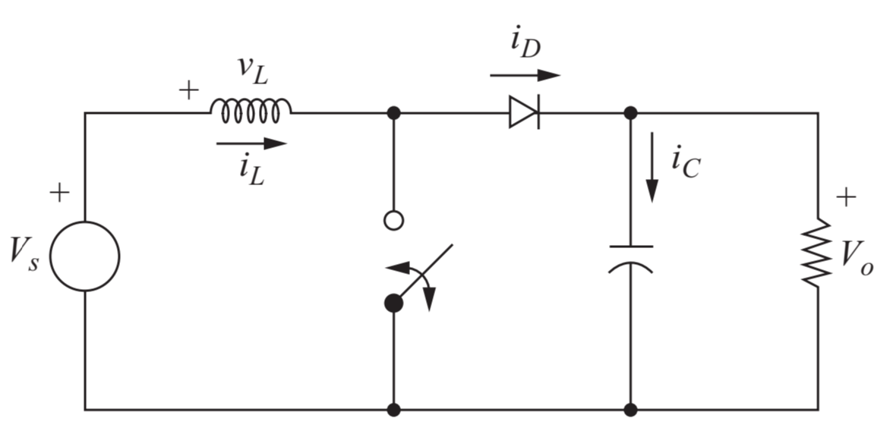

# ProyectoFinal_LabControl
Desarrollo del proyecto final de Laboratorio de Control Automático.

## Parámetros de la planta

A continuación se describen los parámetros del convertidor, en base a los criterios de diseño adoptados.
Considerar que los componentes reales deben de ajustarse a estos parámetros, de acuerdo con la disponibilidad.

Simulación en PLECS: [Boost_PLECS](ArchivosElectro/PLECS/BOOST_converter.plecs?raw=true)

| Parámetro                                                | Valor            | Descripción                          |
| :---                                                     | :---             | :---                                 |
| Entrada nominal Vs                            | 5 V              | Puede tener perturbaciones.          |
| Salida nominal  Vo                            | [10, 20] V       | Se establece en la interfaz.         |
| Ciclo de trabajo nominal Dnom                 | [50.00, 75.00] % | Rango variable.                      |
| Ciclo de trabajo (Vs = 3 V) D8V    | [70.00, 85.00] % | Perturbación inferior.               |
| Ciclo de trabajo (Vs = 7 V) D12V   | [30.00, 65.00] % | Perturbación superior.               |
| Carga RL                                      | 100 Ω            | Basada en _trade-offs_.              |
| Potencia de salida (Vo = 20 V) Po  | 4 W              | De acuerdo con la carga.             |
| Frecuencia de conmutación fsw                 | 80 kHz           | Basada en _trade-offs_.              |
| Inductancia mínima Lmin                       | 78.125 µH        | Inductancia para corriente continua. |
| Capacitor mínimo (ΔVo = 0.1 V) Cmin| 18.75 µF         | Capacitancia de acuerdo al rizado.   |

## Comportamiento de la señal PWM dada por el arduino
El Arduino UNO o Arduino Mega, tiene un reloj base de 16 MHz. Al utilizar una frecuencia de conmutación de 80 kHz
el TOP (valor máximo de cuenta) en la generación de la señal PWM es:

$TOP = \frac{16\text{ MHz}}{80\text{ kHz}} = 200$

Con lo cual se obtiene una resolución para el ciclo de trabajo (D) de:

$resolution = \frac{100}{200} = 0.5$

Entonces, los valores de ciclo de trabajo que puede entregar el Arduino bajo esta configuración son:

$D = 0.5 \cdot n$

$con~n \in [0, 200]$
